Dokdo API
*********

Introduction
============

This page describes Dokdo's application programming interface (API), which is designed to be used with Jupyter Notebook in Python. Before using Dokdo API, make sure your notebook is open within an environment where both QIIME 2 and Dokdo are already installed.

Below, we will go through some examples using publicly available datasets from QIIME 2 tutorials, including `Moving Pictures <https://docs.qiime2.org/2020.8/tutorials/moving-pictures/>`_ and `Atacama soil microbiome <https://docs.qiime2.org/2020.8/tutorials/atacama-soils/>`_. Note that you do not need to download those datasets as they are already included in Dokdo (e.g. ``/path/to/dokdo/data``); however, you will need to change the path to Dokdo.

First, at the beginning of your notebook, enter the following to import Dokdo API.

.. code:: python3

   import dokdo

Next, import the ``matplotlib`` package which should be installed already in your environment because it is included in QIIME 2 installation. With the magic function ``%matplotlib inline``, the output of plotting methods will be displayed inline within Jupyter Notebook.

.. code:: python3

   import matplotlib.pyplot as plt
   %matplotlib inline

Set the seed so that our results are reproducible.

.. code:: python3

   import numpy as np
   np.random.seed(1)

Here, we will see how to control various properties of a figure using the plotting method :meth:`dokdo.denoising_stats_plot` as an example. This method creates a grouped box chart using denoising statistics from the DADA 2 algorithm.

.. code:: python3

    qza_file = '/Users/sbslee/Desktop/dokdo/data/atacama-soil-microbiome-tutorial/denoising-stats.qza'
    metadata_file = '/Users/sbslee/Desktop/dokdo/data/atacama-soil-microbiome-tutorial/sample-metadata.tsv'

    dokdo.denoising_stats_plot(
        qza_file,
        metadata_file,
        'transect-name',
        figsize=(8, 6)
    )

    plt.tight_layout()

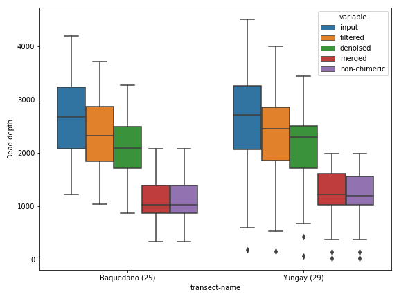

Aesthetics
----------

The first thing we can do is changing the figure style. I personally like the ``seaborn`` package's default style.

.. code:: python3

    import seaborn as sns

    with sns.axes_style('darkgrid'):
        dokdo.denoising_stats_plot(
            qza_file,
            metadata_file,
            'transect-name',
            figsize=(8, 6)
        )

    plt.tight_layout()

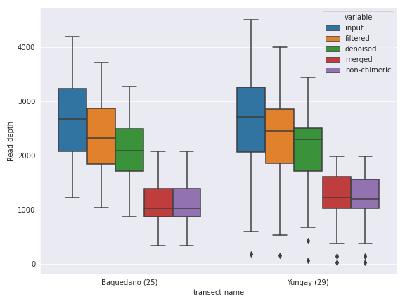

If you're coming from the world of R software, you may find the ``ggplot`` style more soothing for your eyes.

.. code:: python3

    with plt.style.context('ggplot'):
        dokdo.denoising_stats_plot(
            qza_file,
            metadata_file,
            'transect-name',
            figsize=(8, 6)
        )

    plt.tight_layout()

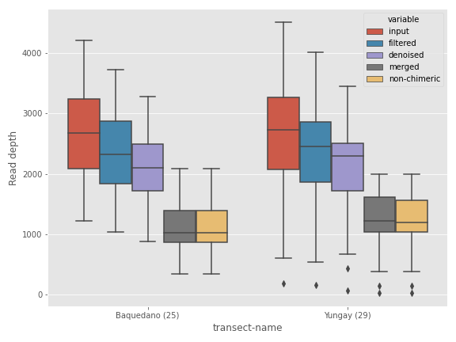

Note that in both cases, the styling is set locally. If you plan to make many plots and want to set the style for all of them (i.e. globally), use the following.

.. code:: python3

    sns.set()
    # plt.style.use('ggplot')

Finally, you can turn off the styling at any point after setting it globally with the following.

.. code:: python3

    # import matplotlib
    # matplotlib.rc_file_defaults()

For the remaining examples, we will use the seaborn style.

Plot Size
---------

There are various ways you can control the figure size. The easiest way is to use the ``figsize`` argument in a plotting method call, as shown below.

.. code:: python3

    dokdo.denoising_stats_plot(
        qza_file,
        metadata_file,
        'transect-name',
        figsize=(9, 3)
    )

    plt.tight_layout()

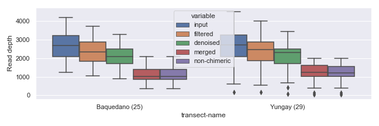

If you plan to draw more than one plot in the same figure (i.e. multiple "subplots"), you can specify size for the entire figure in the following way.

.. code:: python3

    fig, [ax1, ax2] = plt.subplots(1, 2, figsize=(9, 3))

    dokdo.denoising_stats_plot(
        qza_file,
        metadata_file,
        'transect-name',
        ax=ax1
    )

    dokdo.denoising_stats_plot(
        qza_file,
        metadata_file,
        'transect-name',
        ax=ax2
    )

    plt.tight_layout()

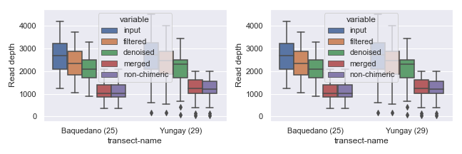

You can also set the width and/or height of individual subplots using ``width_ratios`` and ``height_ratios`` from ``gridspec_kw``.

.. code:: python3

    fig, [ax1, ax2] = plt.subplots(1, 2, figsize=(9, 3), gridspec_kw={'width_ratios': [8, 2]})

    dokdo.denoising_stats_plot(
        qza_file,
        metadata_file,
        'transect-name',
        ax=ax1
    )

    dokdo.denoising_stats_plot(
        qza_file,
        metadata_file,
        'transect-name',
        ax=ax2
    )

    plt.tight_layout()

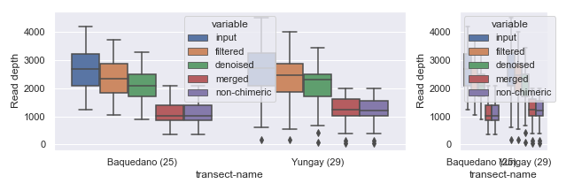

Alternatively, you can combine empty subplots to create a bigger subplot using ``gridspec``.

.. code:: python3

    import matplotlib.gridspec as gridspec

    fig, axes  = plt.subplots(2, 2, figsize=(9, 5))

    dokdo.denoising_stats_plot(
        qza_file,
        metadata_file,
        'transect-name',
        ax=axes[0][0]
    )

    dokdo.denoising_stats_plot(
        qza_file,
        metadata_file,
        'transect-name',
        ax=axes[1][0]
    )

    gs = axes[0, 1].get_gridspec()

    for ax in axes[0:2, 1]:
        ax.remove()

    axbig = fig.add_subplot(gs[0:2, 1])

    dokdo.denoising_stats_plot(
        qza_file,
        metadata_file,
        'transect-name',
        ax=axbig
    )

    plt.tight_layout()

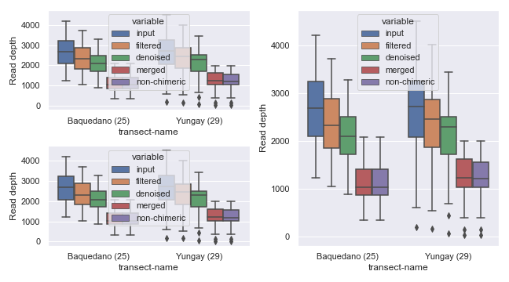

Sample Filtering
----------------

Sometimes, you may want to plot only a subset of the samples. This can be easily done by providing filtered metadata to the plotting method.

.. code:: python3

    from qiime2 import Metadata

    mf = dokdo.get_mf(metadata_file)
    mf = mf[mf['transect-name'] == 'Yungay']

    dokdo.denoising_stats_plot(
        qza_file,
        metadata=Metadata(mf),
        where='transect-name',
        figsize=(8, 6)
    )

    plt.tight_layout()

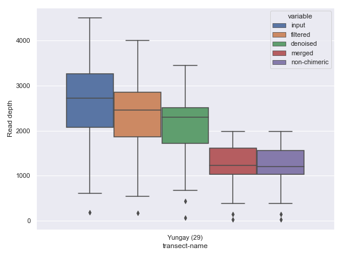

Plotting Legend Separately
--------------------------

In some situations, we may wish to plot the graph and the legend separately. For example, the :meth:`dokdo.taxa_abundance_bar_plot` method by default displays the whole taxa name, which can be quite long and disrupting as shown below.

.. code:: python3

    qzv_file = '/Users/sbslee/Desktop/dokdo/data/moving-pictures-tutorial/taxa-bar-plots.qzv'

    dokdo.taxa_abundance_bar_plot(
        qzv_file,
        level=2,
        count=8,
        figsize=(9, 7)
    )

    plt.tight_layout()

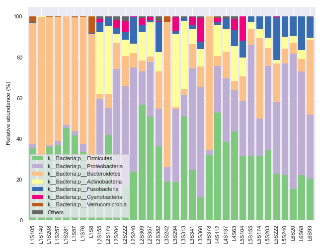

We can ameliorate the issue by plotting the legend separately.

.. code:: python3

    fig, [ax1, ax2] = plt.subplots(1, 2, figsize=(11, 5), gridspec_kw={'width_ratios': [9, 1]})

    dokdo.taxa_abundance_bar_plot(
        qzv_file,
        level=2,
        count=8,
        ax=ax1,
        legend=False
    )

    dokdo.taxa_abundance_bar_plot(
        qzv_file,
        level=2,
        count=8,
        ax=ax2
    )

    handles, labels = ax2.get_legend_handles_labels()

    ax2.clear()
    ax2.legend(handles, labels)
    ax2.axis('off')

    plt.tight_layout()

Plotting QIIME 2 Files vs. Objects
----------------------------------

Thus far, for plotting purposes, we have only used files created by QIIME 2 CLI (i.e. ``.qza`` and ``.qzv`` files). However, we can also plot Python objects created by QIIME 2 API.

For example, we can directly plot the Artifact object from the ``qiime2.plugins.diversity.visualizers.alpha_rarefaction`` method (i.e. QIIME 2 API).

.. code:: python3

    from qiime2 import Artifact, Metadata
    from qiime2.plugins import diversity

    table_file = '/Users/sbslee/Desktop/dokdo/data/moving-pictures-tutorial/table.qza'
    phylogeny_file = '/Users/sbslee/Desktop/dokdo/data/moving-pictures-tutorial/rooted-tree.qza'
    metadata_file = '/Users/sbslee/Desktop/dokdo/data/moving-pictures-tutorial/sample-metadata.tsv'

    table = Artifact.load(table_file)
    phylogeny = Artifact.load(phylogeny_file)
    metadata = Metadata.load(metadata_file)

    rarefaction_result = diversity.visualizers.alpha_rarefaction(
        table=table,
        metadata=metadata,
        phylogeny=phylogeny,
        max_depth=4000
    )

    rarefaction = rarefaction_result.visualization

    dokdo.alpha_rarefaction_plot(rarefaction, legend=False, figsize=(8, 7))

    plt.tight_layout()

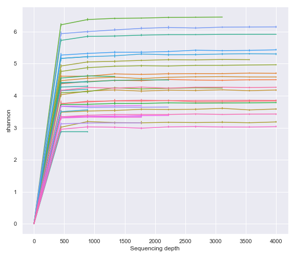

As expected, above gives the same result as using the Visualization file created by the ``qiime diversity alpha-rarefaction`` command (i.e. QIIME 2 CLI).

.. code:: python3

    qzv_file = '/Users/sbslee/Desktop/dokdo/data/moving-pictures-tutorial/alpha-rarefaction.qzv'

    dokdo.alpha_rarefaction_plot(qzv_file, legend=False, figsize=(8, 7))

    plt.tight_layout()

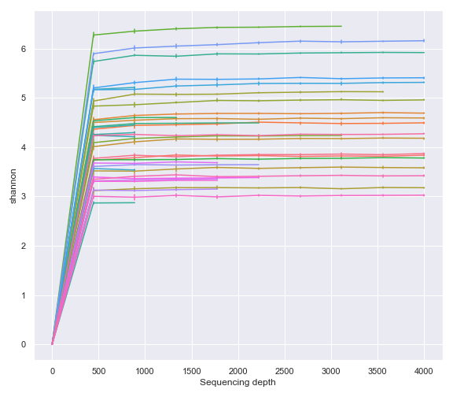

General Methods
===============

cross_association_table
-----------------------

.. currentmodule:: dokdo.api.cross_association

.. autofunction:: cross_association_table

get_mf
------

.. currentmodule:: dokdo.api.common

.. autofunction:: get_mf

ordinate
--------

.. automodule:: dokdo.api.ordinate
   :members:

pname
-----

.. currentmodule:: dokdo.api.common

.. autofunction:: pname

num2sig
-------

.. automodule:: dokdo.api.num2sig
   :members:

wilcoxon
--------

.. automodule:: dokdo.api.wilcoxon
   :members:

mannwhitneyu
------------

.. automodule:: dokdo.api.mannwhitneyu
   :members:

Main Plotting Methods
=====================

read_quality_plot
-----------------

.. automodule:: dokdo.api.read_quality_plot
   :members:

denoising_stats_plot
--------------------

.. automodule:: dokdo.api.denoising_stats_plot
   :members:

alpha_rarefaction_plot
----------------------

.. automodule:: dokdo.api.alpha_rarefaction_plot
   :members:

alpha_diversity_plot
--------------------

.. automodule:: dokdo.api.alpha_diversity_plot
   :members:

beta_2d_plot
------------

.. automodule:: dokdo.api.beta_2d_plot
   :members:

beta_3d_plot
------------

.. automodule:: dokdo.api.beta_3d_plot
   :members:

beta_scree_plot
---------------

.. automodule:: dokdo.api.beta_scree_plot
   :members:

beta_parallel_plot
------------------

.. automodule:: dokdo.api.beta_parallel_plot
   :members:

distance_matrix_plot
--------------------

.. automodule:: dokdo.api.distance_matrix_plot
   :members:

taxa_abundance_bar_plot
-----------------------

.. currentmodule:: dokdo.api.taxa_abundance

.. autofunction:: taxa_abundance_bar_plot

taxa_abundance_box_plot
-----------------------

.. currentmodule:: dokdo.api.taxa_abundance

.. autofunction:: taxa_abundance_box_plot

ancom_volcano_plot
------------------

.. automodule:: dokdo.api.ancom_volcano_plot
  :members:

heatmap
-------

.. currentmodule:: dokdo.api.clustermap

.. autofunction:: heatmap

group_correlation_heatmap
-------------------------

.. currentmodule:: dokdo.api.cross_association

.. autofunction:: group_correlation_heatmap

Other Plotting Methods
======================

addsig
------

.. automodule:: dokdo.api.addsig
  :members:

addpairs
--------

.. automodule:: dokdo.api.addpairs
  :members:

addbiplot
---------

.. automodule:: dokdo.api.addbiplot
  :members:

clustermap
----------

.. currentmodule:: dokdo.api.clustermap

.. autofunction:: clustermap

cross_association_heatmap
-------------------------

.. currentmodule:: dokdo.api.cross_association

.. autofunction:: cross_association_heatmap

cross_association_regplot
-------------------------

.. currentmodule:: dokdo.api.cross_association

.. autofunction:: cross_association_regplot

regplot
-------

.. automodule:: dokdo.api.regplot
  :members:
