Dokdo API
*********

Introduction
============

This page describes Dokdo's application programming interface (API), which is designed to be used with Jupyter Notebook in Python. Before using Dokdo API, make sure your notebook is open within an environment where QIIME 2 and Dokdo are already installed.

First, at the beginning of your notebook, enter the following to import Dokdo API.

.. code:: python3

   >>> import dokdo

Next, import the ``matplotlib`` package which should be installed already in your environment because it is included in QIIME 2 installation.

.. code:: python3

   >>> import matplotlib.pyplot as plt

With the magic function ``%matplotlib inline``, the output of plotting methods will be displayed inline within Jupyter Notebook.

.. code:: python3

    >>> %matplotlib inline

Let's set the seed so that our results are reproducible.

.. code:: python3

   >>> import numpy as np
   >>> np.random.seed(1)

Finally, we are going to use some datasets downloaded from publicly available QIIME 2 tutorials, including `Moving Pictures <https://docs.qiime2.org/2020.8/tutorials/moving-pictures/>`_ and `Atacama soil microbiome <https://docs.qiime2.org/2020.8/tutorials/atacama-soils/>`_.

.. code:: python3

   >>> data_dir = '/Users/sbslee/Desktop/dokdo/data'

Tips
====

Setting Figure Properties
-------------------------

In this section, you'll learn how to control various properties of a figure using the plotting method ``dokdo.denoising_stats_plot`` as an example. This method creates a grouped box chart using denoising statistics from the DADA 2 algorithm.

Let's start with a toy example. The figure below does not have a legend, which is bad, but let's not worry about that now.

.. code:: python3

    >>> qza_file = f'{data_dir}/atacama-soil-microbiome-tutorial/denoising-stats.qza'
    >>> metadata_file = f'{data_dir}/atacama-soil-microbiome-tutorial/sample-metadata.tsv'
    >>> where = 'transect-name'
    >>> args = [qza_file, metadata_file, where]
    >>> dokdo.denoising_stats_plot(*args)
    >>> plt.tight_layout()

.. image:: images/Setting-Figure-Properties-1.png

Aesthetics
^^^^^^^^^^

The first thing we can do is changing the figure style. I personally like the ``seaborn`` package's default style.

.. code:: python3

    >>> import seaborn as sns
    >>> with sns.axes_style('darkgrid'):
    ...     dokdo.denoising_stats_plot(*args)
    >>> plt.tight_layout()

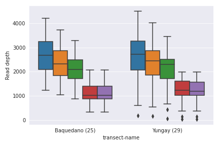

If you're coming from the world of R software, you may find the ``ggplot`` style more soothing for your eyes.

.. code:: python3

    >>> import matplotlib.pyplot as plt
    >>> with plt.style.context('ggplot'):
    ...     dokdo.denoising_stats_plot(*args)
    >>> plt.tight_layout()

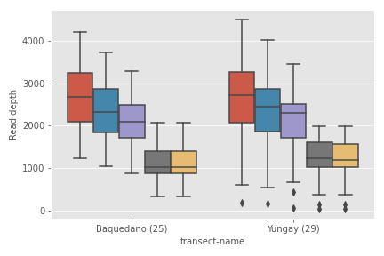

Note that in both cases, the styling is set locally. If you plan to make many plots and want to set the style for all of them (i.e. globally), use the following.

.. code:: python3

    >>> sns.set()
    >>> # plt.style.use('ggplot')

Finally, you can turn off the styling at any point after setting it globally with the following.

.. code:: python3

    >>> # import matplotlib
    >>> # matplotlib.rc_file_defaults()

Plot Size
^^^^^^^^^

There are various ways you can control the figure size. The easiest way is to use the ``figsize`` argument in a plotting method call, as shown below.

.. code:: python3

    >>> dokdo.denoising_stats_plot(*args, figsize=(9, 3))
    >>> plt.tight_layout()

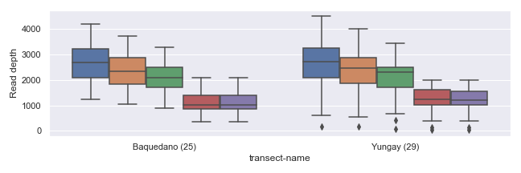

If you plan to draw more than one plot in the same figure (i.e. multiple "subplots"), you can specify size for the entire figure in the following way.

.. code:: python3

    >>> fig, [ax1, ax2] = plt.subplots(1, 2, figsize=(9, 3))
    >>> dokdo.denoising_stats_plot(*args, ax=ax1)
    >>> dokdo.denoising_stats_plot(*args, ax=ax2)
    >>> plt.tight_layout()

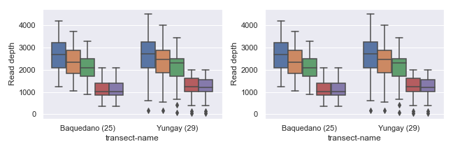

You can also set the width and/or height of individual subplots using ``width_ratios`` and ``height_ratios`` from ``gridspec_kw``.

.. code:: python3

    >>> fig, [ax1, ax2] = plt.subplots(1, 2, figsize=(9, 3), gridspec_kw={'width_ratios': [8, 2]})
    >>> dokdo.denoising_stats_plot(*args, ax=ax1)
    >>> dokdo.denoising_stats_plot(*args, ax=ax2)
    >>> plt.tight_layout()

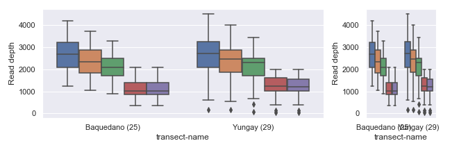

Alternatively, you can combine empty subplots to create a bigger subplot using ``gridspec``.

.. code:: python3

    >>> import matplotlib.gridspec as gridspec
    >>> fig, axes  = plt.subplots(2, 2, figsize=(9, 5))
    >>> dokdo.denoising_stats_plot(*args, ax=axes[0][0])
    >>> dokdo.denoising_stats_plot(*args, ax=axes[1][0])
    >>> gs = axes[0, 1].get_gridspec()
    >>> for ax in axes[0:2, 1]:
    ...     ax.remove()
    >>> axbig = fig.add_subplot(gs[0:2, 1])
    >>> dokdo.denoising_stats_plot(*args, ax=axbig)
    >>> plt.tight_layout()

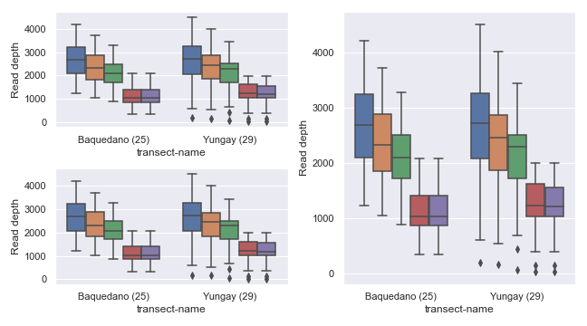

Title, Axis, Legend, Font Size
^^^^^^^^^^^^^^^^^^^^^^^^^^^^^^

Each main plotting method takes a dictionary argument called ``artist_kwargs`` as input that is passed down to the private method ``_artist`` as shown below. For example, the ``show_legend`` argument defined in ``_artist`` is set as ``False`` by default, which means if you want to include the figure legend, you should include ``artist_kwargs=dict(show_legend=True)`` in your method call.

Note that internally, different plotting methods use a different set of default keyword arguments for ``_artist``. For example, by default, the ``dokdo.denoising_stats_plot`` method passes ``ylabel='Read depth'`` to ``_artist`` whereas the ``dokdo.taxa_abundance_bar_plot`` method passes ``ylabel='Relative abundance (%)'``. Of course, you can always easily change the y-axis label with ``artist_kwargs=dict(ylabel='My new y-axis label')``.

.. automodule:: dokdo.api.common
   :members:

   .. automethod:: dokdo.api.common._artist

Below are some simple examples.

.. code:: python3

    >>> fig, [[ax1, ax2, ax3], [ax4, ax5, ax6]] = plt.subplots(2, 3, figsize=(15, 8))
    >>> artist_kwargs1 = dict(title='My title')
    >>> artist_kwargs2 = dict(title='ylog=True', ylog=True, ymin=0.5E1, ymax=1.5E5)
    >>> artist_kwargs3 = dict(title='legend_ncol=2', show_legend=True, legend_ncol=2)
    >>> artist_kwargs4 = dict(title='hide_yticks=True', hide_yticks=True)
    >>> artist_kwargs5 = dict(title='title_fontsize=20', title_fontsize=20)
    >>> artist_kwargs6 = dict(title='legend_fontsize=15', show_legend=True, legend_ncol=2, legend_fontsize=15)
    >>> dokdo.denoising_stats_plot(*args, ax=ax1, artist_kwargs=artist_kwargs1)
    >>> dokdo.denoising_stats_plot(*args, ax=ax2, artist_kwargs=artist_kwargs2)
    >>> dokdo.denoising_stats_plot(*args, ax=ax3, artist_kwargs=artist_kwargs3)
    >>> dokdo.denoising_stats_plot(*args, ax=ax4, artist_kwargs=artist_kwargs4)
    >>> dokdo.denoising_stats_plot(*args, ax=ax5, artist_kwargs=artist_kwargs5)
    >>> dokdo.denoising_stats_plot(*args, ax=ax6, artist_kwargs=artist_kwargs6)
    >>> plt.tight_layout()

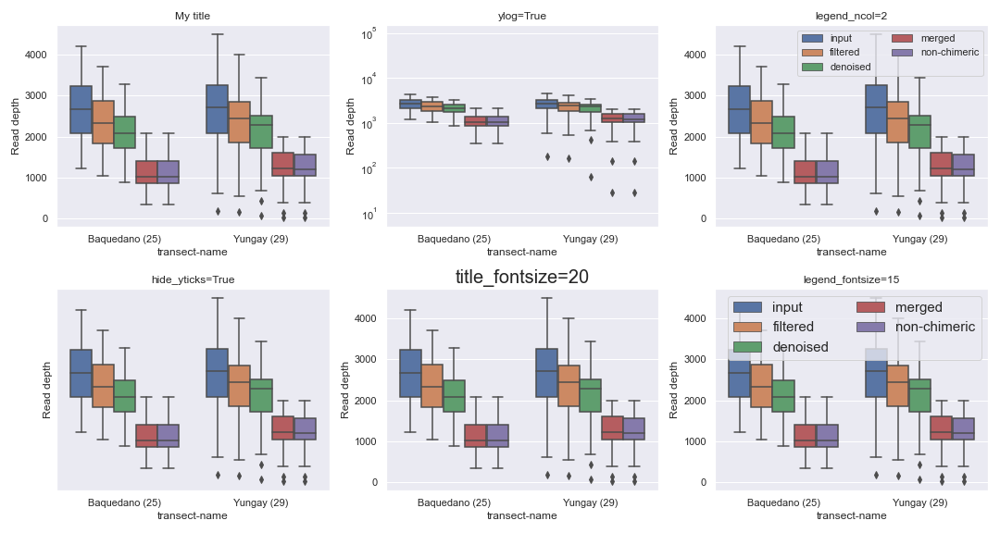

Sample Filtering
^^^^^^^^^^^^^^^^

Sometimes, you may want to plot only a subset of the samples. This can be easily done by providing filtered metadata to the plotting method.

.. code:: python3

    >>> from qiime2 import Metadata
    >>> mf = dokdo.get_mf(metadata_file)
    >>> mf = mf[mf['transect-name'] == 'Yungay']
    >>> metadata = Metadata(mf)
    >>> dokdo.denoising_stats_plot(qza_file, metadata=metadata, where=where)
    >>> plt.tight_layout()

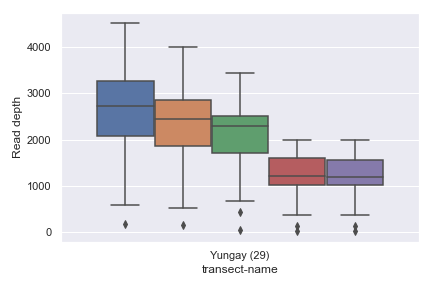

Plotting Legend Separately
--------------------------

In some situations, we may wish to plot the graph and the legend separately. For example, the ``dokdo.taxa_abundance_bar_plot`` method by default displays the whole taxa name, which can be quite long and disrupting as shown below.

.. code:: python3

    >>> qzv_file = f'{data_dir}/moving-pictures-tutorial/taxa-bar-plots.qzv'
    >>> dokdo.taxa_abundance_bar_plot(qzv_file,
    ...                               level=2,
    ...                               count=8,
    ...                               figsize=(9, 5),
    ...                               artist_kwargs=dict(show_legend=True))
    >>> plt.tight_layout()

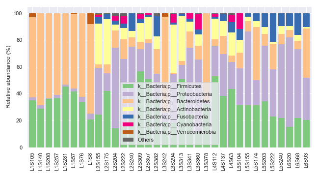

We can ameliorate the issue by plotting the legend separately with ``legend_only=True``.

.. code:: python3

    >>> fig, [ax1, ax2] = plt.subplots(1, 2, figsize=(11, 5), gridspec_kw={'width_ratios': [9, 1]})
    >>> dokdo.taxa_abundance_bar_plot(qzv_file, ax=ax1, level=2, count=8)
    >>> dokdo.taxa_abundance_bar_plot(qzv_file, ax=ax2, level=2, count=8,
    ...                               artist_kwargs=dict(legend_loc='upper left',
    ...                                                  legend_only=True))
    >>> plt.tight_layout()

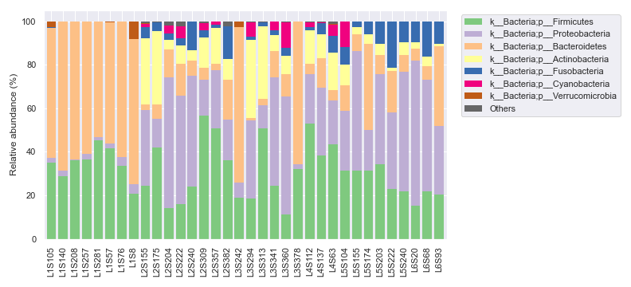

Plotting QIIME 2 Files vs. Objects
----------------------------------

Thus far, for plotting purposes, we have only used files created by QIIME 2 CLI (i.e. ``.qza`` and ``.qzv`` files). However, we can also plot Python objects created by QIIME 2 API.

For example, we can directly plot the Artifact object from the ``qiime2.plugins.diversity.visualizers.alpha_rarefaction`` method (i.e. QIIME 2 API).

.. code:: python3

    >>> from qiime2 import Artifact
    >>> from qiime2 import Metadata
    >>> from qiime2.plugins import diversity
    >>> table = Artifact.load(f'{data_dir}/moving-pictures-tutorial/table.qza')
    >>> phylogeny = Artifact.load(f'{data_dir}/moving-pictures-tutorial/rooted-tree.qza')
    >>> metadata = Metadata.load(f'{data_dir}/moving-pictures-tutorial/sample-metadata.tsv')
    >>> rarefaction_result = diversity.visualizers.alpha_rarefaction(table=table,
    ...                                                              metadata=metadata,
    ...                                                              phylogeny=phylogeny,
    ...                                                              max_depth=4000)
    >>> rarefaction = rarefaction_result.visualization
    >>> dokdo.alpha_rarefaction_plot(rarefaction)
    >>> plt.tight_layout()

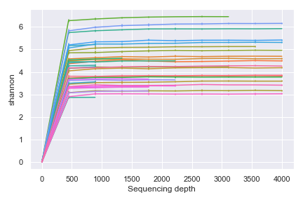

As expected, above gives the same result as using the Visualization file created by the ``qiime diversity alpha-rarefaction`` command (i.e. QIIME 2 CLI).

.. code:: python3

    >>> qzv_file = f'{data_dir}/moving-pictures-tutorial/alpha-rarefaction.qzv'
    >>> dokdo.alpha_rarefaction_plot(qzv_file)
    >>> plt.tight_layout()

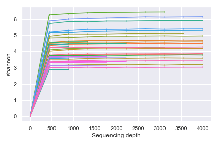

General Methods
===============

get_mf
------

.. automodule:: dokdo.api.get_mf
   :members:

ordinate
--------

.. automodule:: dokdo.api.ordinate
   :members:

pname
-----

.. automodule:: dokdo.api.pname
   :members:

num2sig
-------

.. automodule:: dokdo.api.num2sig
   :members:

wilcoxon
--------

.. automodule:: dokdo.api.wilcoxon
   :members:

mannwhitneyu
------------

.. automodule:: dokdo.api.mannwhitneyu
   :members:

Main Plotting Methods
=====================

read_quality_plot
-----------------

.. automodule:: dokdo.api.read_quality_plot
   :members:

denoising_stats_plot
--------------------

.. automodule:: dokdo.api.denoising_stats_plot
   :members:

alpha_rarefaction_plot
----------------------

.. automodule:: dokdo.api.alpha_rarefaction_plot
   :members:

alpha_diversity_plot
--------------------

.. automodule:: dokdo.api.alpha_diversity_plot
   :members:

beta_2d_plot
------------

.. automodule:: dokdo.api.beta_2d_plot
   :members:

beta_3d_plot
------------

.. automodule:: dokdo.api.beta_3d_plot
   :members:

beta_scree_plot
---------------

.. automodule:: dokdo.api.beta_scree_plot
   :members:

beta_parallel_plot
------------------

.. automodule:: dokdo.api.beta_parallel_plot
   :members:

distance_matrix_plot
--------------------

.. automodule:: dokdo.api.distance_matrix_plot
   :members:

taxa_abundance_bar_plot
-----------------------

.. automodule:: dokdo.api.taxa_abundance
   :members: taxa_abundance_bar_plot

taxa_abundance_box_plot
-----------------------

.. automodule:: dokdo.api.taxa_abundance
  :members: taxa_abundance_box_plot

ancom_volcano_plot
------------------

.. automodule:: dokdo.api.ancom_volcano_plot
  :members:

Other Plotting Methods
======================

addsig
------

.. automodule:: dokdo.api.addsig
  :members:

addpairs
--------

.. automodule:: dokdo.api.addpairs
  :members:

addbiplot
---------

.. automodule:: dokdo.api.addbiplot
  :members:

heatmap
-------

.. automodule:: dokdo.api.heatmap
  :members:

regplot
-------

.. automodule:: dokdo.api.regplot
  :members:
