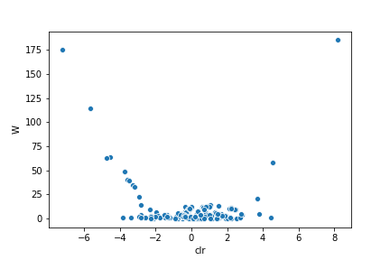

QIIME 2 CLI
***********

Introduction
============

This page documents select information and resources pertaining to the QIIME2 CLI that I find particularly useful. That said, any materials on this page may not be applicable, or even appropriate, for your specific case (you've been warned!). For full description and details on the QIIME2 CLI, I highly recommend that you visit the QIIME2 Docs and/or Forum.

Removal of Adapters and Primers
===============================

Removal of adapters and primers from raw sequence data is important for downstream analyses, such as amplicon sequence variant (ASV) identification and taxonomy classification. We can easily achieve this with the ``qiime cutadapt`` command (click `here <https://docs.qiime2.org/2020.8/plugins/available/cutadapt/>`_ to see the docs). However, I almost never use it for two reasons. First, I usually don't have to deal with adapters at all because the raw data in my case are FASTQ files that have been already demultiplexed with adapters removed in the process. Second, since the primers we use isn’t of variable length, using the ``--p-trim-left-f`` and ``--p-trim-left-r`` options when running DADA2 is much easier and also helps avoid sequencing error slipping through (`ref <https://forum.qiime2.org/t/cutadapt-trim-paired-vs-dada2-option-p-trim-left-help-with-interpretation-of-cutadapt-output/10101/2>`_).

In case I ever need to use the ``qiime cutadapt`` command, here is how I would do: The following command will remove the 341F (17bp) and 805R (21bp) primers.

.. code-block:: console

    $ qiime cutadapt trim-paired \
        --i-demultiplexed-sequences paired-end-demux.qza \
        --o-trimmed-sequences paired-end-demux-trimmed.qza \
        --p-front-f CCTACGGGNGGCWGCAG \
        --p-front-r GACTACHVGGGTATCTAATCC \
        --verbose

See also:

`SMART-seq family <https://teichlab.github.io/scg_lib_structs/methods_html/SMART-seq_family.html>`_

Import Sequences to QIIME 2
===========================

Before denoising sequence reads, we have to import those reads to QIIME 2. For paired-end reads, we can use the following command:

.. code-block:: console

    $ qiime tools import \
        --type 'SampleData[PairedEndSequencesWithQuality]' \
        --input-path manifest-file.tsv \
        --input-format PairedEndFastqManifestPhred33V2 \
        --output-path paired-end-demux.qza
    Imported manifest-file.tsv as PairedEndFastqManifestPhred33V2 to paired-end-demux.qza

Note that you can easily create a ``manifest-file.tsv`` using the ``make-manifest`` command in Dokdo.

Once importing is finished, we create a ``demux.qzv`` file in order to assess the read quality.

.. code-block:: console

    $ qiime demux summarize \
        --i-data paired-end-demux.qza \
        --o-visualization demux.qzv
    Saved Visualization to: demux.qzv

Identify ASVs
=============

Identifying ASVs is achieved by denoising observed sequence reads that have been imported to QIIME 2 (``paired-end-demux.qza``) using the DADA 2 program. Generally speaking, the command line looks something like below. You can use ``--p-n-threads`` to speed up the process.

.. code-block:: console

    $ qiime dada2 denoise-paired \
        --i-demultiplexed-seqs paired-end-demux.qza \
        --p-trunc-len-f 245 \
        --p-trunc-len-r 240 \
        --p-trim-left-f 17 \
        --p-trim-left-r 21 \
        --o-table table.qza \
        --o-representative-sequences rep-seqs.qza \
        --o-denoising-stats denoising-stats.qza
    Saved FeatureTable[Frequency] to: table.qza
    Saved FeatureData[Sequence] to: rep-seqs.qza
    Saved SampleData[DADA2Stats] to: denoising-stats.qza

However, this step often takes a long time and I highly recommend you to use a computing cluster if you have one. For example, I use the below command to submit my job.

.. code-block:: console

    $ qsub -S /bin/sh -cwd -l h=cm476 -V -pe pePAC 45 qsubme-denoise-paired.sh

Below is what the ``qsubme-denoise-paired.sh`` file looks like:

.. code-block:: console

    qiime dada2 denoise-paired \
      --i-demultiplexed-seqs paired-end-demux.qza \
      --p-trunc-len-f 245 \
      --p-trunc-len-r 240 \
      --p-trim-left-f 17 \
      --p-trim-left-r 21 \
      --p-n-threads 40 \
      --o-table table.qza \
      --o-representative-sequences rep-seqs.qza \
      --o-denoising-stats denoising-stats.qza

    qiime feature-table summarize \
      --i-table table.qza \
      --m-sample-metadata-file sample-metadata.tsv \
      --o-visualization table.qzv

    qiime feature-table tabulate-seqs \
      --i-data rep-seqs.qza \
      --o-visualization rep-seqs.qzv

    qiime metadata tabulate \
      --m-input-file denoising-stats.qza \
      --o-visualization denoising-stats.qzv

Merge Multiple Sequencing Runs
==============================

.. code-block:: console

    $ qiime feature-table merge \
        --i-tables table-run1.qza \
        --i-tables table-run2.qza \
        --i-tables table-run3.qza \
        --o-merged-table table-merged.qza
    Saved FeatureTable[Frequency] to: table-merged.qza

    $ qiime feature-table merge-seqs \
        --i-data rep-seqs-run1.qza \
        --i-data rep-seqs-run2.qza \
        --i-data rep-seqs-run3.qza \
        --o-merged-data rep-seqs-merged.qza
    Saved FeatureData[Sequence] to: rep-seqs-merged.qza

Alpha Rarefaction
=================

.. code-block:: console

    $ qiime diversity alpha-rarefaction \
        --i-table table.qza \
        --i-phylogeny rooted-tree.qza \
        --p-max-depth 57349 \
        --m-metadata-file sample-metadata.tsv \
        --o-visualization alpha-rarefaction.qzv
    Saved Visualization to: alpha-rarefaction.qzv

Beta Rarefaction
================

.. code-block:: console

    $ qiime diversity beta-rarefaction \
        --i-table table.qza \
        --i-phylogeny rooted-tree.qza \
        --p-metric weighted_unifrac \
        --p-clustering-method upgma \
        --m-metadata-file sample-metadata-updated.tsv \
        --p-sampling-depth 7318 \
        --o-visualization beta-rarefaction.qza

Compute Core Metrics
====================

The QIIME 2 team has kindly created a convenience command so that users can run a single command to execute multiple QIIME 2 actions simultaneously. This command is called ``core-metrics-phylogenetic``, and it outputs many essential metrics such as alpha diversity and beta diversity.

.. code-block:: console

    $ qiime diversity core-metrics-phylogenetic \
        --i-phylogeny rooted-tree.qza \
        --i-table table.qza \
        --p-sampling-depth 7318 \
        --m-metadata-file sample-metadata.tsv \
        --output-dir core-metrics-results
    Saved FeatureTable[Frequency] to: core-metrics-results/rarefied_table.qza
    Saved SampleData[AlphaDiversity] to: core-metrics-results/faith_pd_vector.qza
    Saved SampleData[AlphaDiversity] to: core-metrics-results/observed_features_vector.qza
    Saved SampleData[AlphaDiversity] to: core-metrics-results/shannon_vector.qza
    Saved SampleData[AlphaDiversity] to: core-metrics-results/evenness_vector.qza
    Saved DistanceMatrix to: core-metrics-results/unweighted_unifrac_distance_matrix.qza
    Saved DistanceMatrix to: core-metrics-results/weighted_unifrac_distance_matrix.qza
    Saved DistanceMatrix to: core-metrics-results/jaccard_distance_matrix.qza
    Saved DistanceMatrix to: core-metrics-results/bray_curtis_distance_matrix.qza
    Saved PCoAResults to: core-metrics-results/unweighted_unifrac_pcoa_results.qza
    Saved PCoAResults to: core-metrics-results/weighted_unifrac_pcoa_results.qza
    Saved PCoAResults to: core-metrics-results/jaccard_pcoa_results.qza
    Saved PCoAResults to: core-metrics-results/bray_curtis_pcoa_results.qza
    Saved Visualization to: core-metrics-results/unweighted_unifrac_emperor.qzv
    Saved Visualization to: core-metrics-results/weighted_unifrac_emperor.qzv
    Saved Visualization to: core-metrics-results/jaccard_emperor.qzv
    Saved Visualization to: core-metrics-results/bray_curtis_emperor.qzv

Alpha Diversity Significance
============================

When you compute the core metrics as shown above, you will have already produced alpha diversity measurements. All you need to do is create the visualization files.

.. code-block:: console

    $ qiime diversity alpha-group-significance \
        --i-alpha-diversity core-metrics-results/faith_pd_vector.qza \
        --m-metadata-file sample-metadata.tsv \
        --o-visualization core-metrics-results/faith_pd_group-significance.qzv
    Saved Visualization to: core-metrics-results/faith_pd_group-significance.qzv

    $ qiime diversity alpha-group-significance \
        --i-alpha-diversity core-metrics-results/evenness_vector.qza \
        --m-metadata-file sample-metadata.tsv \
        --o-visualization core-metrics-results/evenness_group-significance.qzv
    Saved Visualization to: core-metrics-results/evenness_group-significance.qzv

    $ qiime diversity alpha-group-significance \
        --i-alpha-diversity core-metrics-results/shannon_vector.qza \
        --m-metadata-file sample-metadata.tsv \
        --o-visualization core-metrics-results/shannon_group-significance.qzv
    Saved Visualization to: core-metrics-results/shannon_group-significance.qzv

    $ qiime diversity alpha-group-significance \
        --i-alpha-diversity core-metrics-results/observed_features_vector.qza \
        --m-metadata-file sample-metadata.tsv \
        --o-visualization core-metrics-results/observed_features_group-significance.qzv
    Saved Visualization to: core-metrics-results/observed_features_group-significance.qzv

Each visualization comes with p-values and q-values (p-values adjusted by the Benjamini-Hochberg correction) from Kruskal-Wallis testing. Kruskal-Wallis is a non-parametric version of the one-way ANOVA test. Just as ANOVA can be applied to 2+ groups and is a generalization of the t-test (which works with 2 groups only), Kruskal-Wallis can be applied to 2+ groups and is a generalization of the Mann-Whitney U test.

q-value = adjusted p-value = p-value * (total number of hypotheses tested) / (rank of the p-value)

Beta Diversity Significance
===========================

When you compute the core metrics as shown above, you will have already produced beta diversity measurements. All you need to do is create the visualization file.

.. code-block:: console

    $ qiime diversity beta-group-significance \
        --i-distance-matrix core-metrics-results/weighted_unifrac_distance_matrix.qza \
        --m-metadata-file sample-metadata.tsv \
        --m-metadata-column body-site \
        --o-visualization weighted_unifrac_body-site_significance.qzv
    Saved Visualization to: weighted_unifrac_body-site_significance.qzv

The visualization file comes with a p-value from a permutation-based statistical test (e.g. PERMANOVA).

If you want to see the effect of more than one grouping variable, use the following:

.. code-block:: console

    $ qiime diversity adonis \
        --i-distance-matrix core-metrics-results/weighted_unifrac_distance_matrix.qza \
        --m-metadata-file sample-metadata.tsv \
        --p-formula "subject+year" \
        --o-visualization adonis.qzv
    Saved Visualization to: adonis.qzv

Build Phylogenetic Tree
=======================

Constructing a phylogenetic tree of observed features (i.e. representative sequences) is crucial for many of the downstream analyses. We can easily build a phylogenetic tree by following the four steps described below.

**Step 1. Carry out multiple sequence alignment using the Mafft algorithm.** You can use ``--p-n-threads`` to speed up the process.

.. code-block:: console

    $ qiime alignment mafft \
        --i-sequences rep-seqs.qza \
        --o-alignment aligned-rep-seqs.qza
    Saved FeatureData[AlignedSequence] to: aligned-rep-seqs.qza

**Step 2. Mask unconserved and highly gapped positions from an alignment.** These positions are generally considered to add noise to a resulting phylogenetic tree.

.. code-block:: console

    $ qiime alignment mask \
        --i-alignment aligned-rep-seqs.qza \
        --o-masked-alignment masked-aligned-rep-seqs.qza
    Saved FeatureData[AlignedSequence] to: masked-aligned-rep-seqs.qza

**Step 3. Create the tree using the Fasttree algorithm.** You can use ``--p-n-threads`` to speed up the process.

.. code-block:: console

    $ qiime phylogeny fasttree \
        --i-alignment masked-aligned-rep-seqs.qza \
        --o-tree unrooted-tree.qza
    Saved Phylogeny[Unrooted] to: unrooted-tree.qza

**Step 4: Root the tree using the longest root.**

.. code-block:: console

    $ qiime phylogeny midpoint-root \
        --i-tree unrooted-tree.qza \
        --o-rooted-tree rooted-tree.qza
    Saved Phylogeny[Rooted] to: rooted-tree.qza

Filtering Data
==============

In QIIME 2, we can perform filtering on feature tables, sequences, and even distance matrices.

Feature Table-Based Filtering
-----------------------------

We can filter representative sequences based on an already filtered feature table.

.. code-block:: console

    $ qiime feature-table filter-seqs \
        --i-data rep-seqs.qza \
        --i-table filtered-table.qza \
        --o-filtered-data filtered-rep-seqs.qza
    Saved FeatureData[Sequence] to: filtered-rep-seqs.qza

Sample ID-Based Filtering
-------------------------

The following will retain the samples specified in a metadata file.

.. code-block:: console

    $ echo SampleID > output/QIIME-2-CLI/samples-to-keep.tsv
    $ echo L1S8 >> output/QIIME-2-CLI/samples-to-keep.tsv
    $ echo L1S105 >> output/QIIME-2-CLI/samples-to-keep.tsv

    $ qiime feature-table filter-samples \
        --i-table data/moving-pictures-tutorial/table.qza \
        --m-metadata-file output/QIIME-2-CLI/samples-to-keep.tsv \
        --o-filtered-table output/QIIME-2-CLI/sample-id-keep-table.qza

The following will remove the samples specified in a metadata file.

.. code-block:: console

    $ echo SampleID > output/QIIME-2-CLI/samples-to-remove.tsv
    $ echo L1S8 >> output/QIIME-2-CLI/samples-to-remove.tsv

    $ qiime feature-table filter-samples \
        --i-table output/QIIME-2-CLI/sample-id-keep-table.qza \
        --m-metadata-file output/QIIME-2-CLI/samples-to-remove.tsv \
        --p-exclude-ids \
        --o-filtered-table output/QIIME-2-CLI/sample-id-remove-table.qza

Feature ID-Based Filtering
--------------------------

The following will retain the features specified in a metadata file.

.. code-block:: console

    $ echo FeatureID > output/QIIME-2-CLI/features-to-keep.tsv
    $ echo 4b5eeb300368260019c1fbc7a3c718fc >> output/QIIME-2-CLI/features-to-keep.tsv
    $ echo fe30ff0f71a38a39cf1717ec2be3a2fc >> output/QIIME-2-CLI/features-to-keep.tsv

    $ qiime feature-table filter-features \
        --i-table data/moving-pictures-tutorial/table.qza \
        --m-metadata-file output/QIIME-2-CLI/features-to-keep.tsv \
        --o-filtered-table output/QIIME-2-CLI/feature-id-keep-table.qza

The following will remove the features specified in a metadata file.

.. code-block:: console

    $ echo FeatureID > output/QIIME-2-CLI/features-to-remove.tsv
    $ echo 4b5eeb300368260019c1fbc7a3c718fc >> output/QIIME-2-CLI/features-to-remove.tsv

    $ qiime feature-table filter-features \
        --i-table output/QIIME-2-CLI/feature-id-keep-table.qza \
        --m-metadata-file output/QIIME-2-CLI/features-to-remove.tsv \
        --p-exclude-ids \
        --o-filtered-table output/QIIME-2-CLI/feature-id-remove-table.qza

Contingency-Based Filtering
---------------------------

To filter out features that show up in only one sample:

.. code-block:: console

    $ qiime feature-table filter-features \
        --i-table table.qza \
        --p-min-samples 2 \
        --o-filtered-table filtered-table.qza
    Saved FeatureTable[Frequency] to: filtered-table.qza

To filter for samples whose ``body-site`` is either left palm or right palm:

.. code-block:: console

    $ qiime feature-table filter-samples \
        --i-table table.qza \
        --m-metadata-file sample-metadata.tsv \
        --p-where "[body-site] IN ('left palm', 'right palm')" \
        --o-filtered-table filtered-table.qza

Total-Frequency-Based Filtering
-------------------------------

We filter out ASVs with a total abundance (summed across all samples) of less than 10.

.. code-block:: console

    $ qiime feature-table filter-features \
        --i-table table-s2.qza \
        --p-min-frequency 10 \
        --o-filtered-table table-s2-f10.qza
    Saved FeatureTable[Frequency] to: filtered-table.qza

Taxonomy-Based Filtering
------------------------

.. code-block:: console

    $ qiime taxa filter-table \
        --i-table table-s2-f10.qza \
        --i-taxonomy taxonomy-c0.qza \
        --p-exclude mitochondria,chloroplast \
        --o-filtered-table filtered-table.qza
    Saved FeatureTable[Frequency] to: filtered-table.qza

Taxonomy Classifier
===================

QIIME 2 provides pre-trained taxonomy classifiers `here <https://docs.qiime2.org/2020.8/data-resources/>`__. They were trained on either full-length sequences or 515F/806R region of sequences (V4 region).

We can train our own classifier for the 341F/805R region (V3-V4 region) by following this `tutorial <https://docs.qiime2.org/2020.8/tutorials/feature-classifier/>`__.

First, download the sequence and taxonomy files from `here <https://docs.qiime2.org/2020.8/data-resources/>`__.

Second, extract the sequence reads for the V3-V4 region.

.. code-block:: console

    $ qiime feature-classifier extract-reads \
        --i-sequences silva-138-99-seqs.qza \
        --p-f-primer CCTACGGGNGGCWGCAG \
        --p-r-primer GACTACHVGGGTATCTAATCC \
        --p-n-jobs 40 \
        --o-reads silva-138-99-341F-805R-seqs.qza

Third, train the Naive Bayes classifier.

.. code-block:: console

    $ qiime feature-classifier fit-classifier-naive-bayes \
        --i-reference-reads silva-138-99-341F-805R-seqs.qza \
        --i-reference-taxonomy silva-138-99-tax.qza \
        --o-classifier silva-138-99-341F-805R-nb-classifier.qza

Classify Taxonomy
=================

I perform taxonomy classification with the ``qiime feature-classifier classify-sklearn`` command (click `here <https://docs.qiime2.org/2020.8/plugins/available/feature-classifier/classify-sklearn/>`__ to see the official docs).

Each classification comes with a confidence value. You can click `here <https://forum.qiime2.org/t/question-about-asvs-that-are-taxonomically-classified-as-unassigned-despite-of-having-a-high-confidence-value-e-g-0-7/16671>`__ to see my extensive discussion with the QIIME2 team about how confidence values are computed. I highly recommend you to read the post since they marked it with the ``best-of-the-forum`` tag!

Below is the most minimal command one can run.

.. code-block:: console

    $ qiime feature-classifier classify-sklearn \
        --i-classifier silva-138-99-nb-classifier.qza \
        --i-reads rep-seqs.qza \
        --o-classification taxonomy.qza

I often add the ``--p-n-jobs`` parameter because it takes a long time to classify thousands of sequences. Then, I use the below command to submit my job.

.. code-block:: console

    $ qsub -S /bin/sh -cwd -l h=cm476 -V -pe pePAC 20 classify.sh

I also frequently use the ``--p-confidence`` parameter to study the identity of "Unassigned" classifications; setting it to 0 will calculate confidence but not apply it to limit the taxonomic depth of the assignments.

Once classification is over, you can create visualization of the output file.

.. code-block:: console

    $ qiime metadata tabulate \
        --m-input-file taxonomy.qza \
        --o-visualization taxonomy.qzv

Create Taxonomy Barplot
=======================

Finally, the famous bar chart can be created as shown below.

.. code-block:: console

    $ qiime taxa barplot \
        --i-table table.qza \
        --i-taxonomy taxonomy.qza \
        --m-metadata-file sample-metadata.tsv \
        --o-visualization taxa-bar-plots.qzv
    Saved Visualization to: taxa-bar-plots.qzv

Differential Abundance
======================

In QIIME 2, differential abundance of bacteria can be tested using the analysis of composition of microbiomes (ANCOM). After each ANCOM, we can make a volcano plot as shown below:

where the x-axis is centered log-ratio (CLR) of relative abundance and the y-axis is the W value which represents the number of rejected null hypotheses. The W value will be explained in more detail below. If you are not familiar with the CLR transformation, it is defined as:

:math:`\hat{x} = \left \{ \log \left ( \frac{x_1}{G(x)} \right ), ...,\log \left ( \frac{x_n}{G(x)} \right ) \right \}=\left \{ \log(x_1)-\log(G(x)), ..., \log(x_n)-\log(G(x)) \right \}`

where :math:`x` is the observed frequencies and :math:`G(x)` is their geometric mean.

This `post <https://forum.qiime2.org/t/ancom-clr-results-confusion/8794/3>`__ by Jamie Morton in QIIME 2 Forum gives a great summary of the meaning of CLR:

    clr coordinate do not necessarily imply increase / decrease (since it is not possible do this in the first place). Instead, these coordinates represent log-fold change relative to the average microbe.

    So it is possible that both taxa are higher, but one of them is increased greater than the average microbe and the other is increased less than the average microbe (provided that the average microbe is also increased between these two conditions).

Additionally, this `post <https://forum.qiime2.org/t/specify-w-cutoff-for-anacom/1844/10>`__ by Jamie Morton in QIIME 2 Forum gives a great summary of ANCOM (I am just copying and pasting below):

    The W value is essentially a count of the number of sub-hypotheses that have passed for a given species.

    Underneath the hood, ANCOM is just running bunch of pairwise tests. Each sub-hypothesis is structured something like follows (for the 2 class case)

    :math:`H_{0 (ij)}: mean(\log \frac{x_i}{x_j}) = mean(\log \frac{y_i}{y_j})`

    where :math:`x_i` denotes the :math:`ith` species abundances from samples :math:`x`, :math:`i_j` denotes the :math:`jth` species abundances from samples :math:`x`

    and where :math:`y_i` denotes the :math:`ith` species abundances from samples :math:`y`, :math:`i_j` denotes the :math:`jth` species abundances from samples :math:`y`

    The W value is just a count of the number of times :math:`H_0(ij)` is rejected 60 times. This basically means, that the ratio OTU :math:`k` and 60 other species were detected to be significantly different across the :math:`x` and :math:`y` groups.

Note that the threshold for the W value is automatically determined. Assumption: only few ASVs (< 25%) are changing between the groups.

.. code-block:: console

    $ qiime feature-table filter-samples \
        --i-table table.qza \
        --m-metadata-file sample-metadata-2.tsv \
        --p-where "[Site] IN ('N', 'T')" \
        --o-filtered-table tissue-table.qza
    Saved FeatureTable[Frequency] to: tissue-table.qza

    $ qiime composition add-pseudocount \
        --i-table tissue-table.qza \
        --o-composition-table comp-tissue-table.qza
    Saved FeatureTable[Composition] to: comp-tissue-table.qza

    $ qiime composition ancom \
        --i-table comp-tissue-table.qza \
        --m-metadata-file sample-metadata-3.tsv \
        --m-metadata-column SelfCluster \
        --o-visualization ancom-SelfCluster.qzv
    Saved Visualization to: ancom-SelfCluster.qzv

If you want to perform a differential abundance test at a specific taxonomic level, use the following:

.. code-block:: console

    $ qiime taxa collapse \
        --i-table gut-table.qza \
        --i-taxonomy taxonomy.qza \
        --p-level 6 \
        --o-collapsed-table gut-table-l6.qza
    Saved FeatureTable[Frequency] to: gut-table-l6.qza

    $ qiime composition add-pseudocount \
        --i-table gut-table-l6.qza \
        --o-composition-table comp-gut-table-l6.qza
    Saved FeatureTable[Composition] to: comp-gut-table-l6.qza

    $ qiime composition ancom \
        --i-table comp-gut-table-l6.qza \
        --m-metadata-file sample-metadata.tsv \
        --m-metadata-column subject \
        --o-visualization l6-ancom-subject.qzv
    Saved Visualization to: l6-ancom-subject.qzv

Taxonomy to Sequence
====================

.. code-block:: console

    $ qiime metadata tabulate \
        --m-input-file data/moving-pictures-tutorial/rep-seqs-dada2.qza \
        --m-input-file data/moving-pictures-tutorial/taxonomy.qza \
        --o-visualization output/QIIME-2-CLI/tabulated-feature-metadata.qzv

Exporting Artifacts
===================

To export a feature table (i.e. ``FeatureTable[Frequency]``) to a .tsv file:

.. code-block:: console

    $ qiime tools export \
        --input-path feature-table.qza \
        --output-path exported-feature-table

    $ biom convert \
        -i exported-feature-table/feature-table.biom \
        -o feature-table.tsv \
        --to-tsv

See also:

- `Exporting data <https://docs.qiime2.org/2020.8/tutorials/exporting/>`__

Biplot
======

.. code-block:: console

    # Rarefy the feature table.
    $ qiime feature-table rarefy \
        --i-table filtered-table.qza \
        --p-sampling-depth 11972 \
        --o-rarefied-table rarefied-table.qza

    # Generate FeatureTable[RelativeFrequency].
    $ qiime feature-table relative-frequency \
        --i-table rarefied-table.qza \
        --o-relative-frequency-table relative-frequency-table.qza

    # Compute distiance matrix.
    $ qiime diversity-lib unweighted-unifrac \
        --i-table rarefied-table.qza \
        --i-phylogeny rooted-tree.qza \
        --o-distance-matrix unweighted-unifrac-matrix.qza

    # Perform PCoA.
    $ qiime diversity pcoa \
        --i-distance-matrix unweighted-unifrac-matrix.qza \
        --p-number-of-dimensions 10 \
        --o-pcoa unweighted-unifrac-pcoa.qza

    # Create biplot.
    $ qiime diversity pcoa-biplot \
        --i-pcoa unweighted-unifrac-pcoa.qza \
        --i-features relative-frequency-table.qza \
        --o-biplot unweighted-unifrac-biplot.qza

    # Create biplot visualization.
    $ qiime emperor biplot \
        --i-biplot unweighted-unifrac-biplot.qza \
        --m-sample-metadata-file sample-metadata.tsv \
        --m-feature-metadata-file taxonomy-c0.qza \
        --o-visualization unweighted-unifrac-biplot.qzv

See also:

- `How to use pcoa-biplot <https://forum.qiime2.org/t/how-to-use-pcoa-biplot/7953>`__
- `Biplot visualization error <https://forum.qiime2.org/t/biplot-visualization-error/12507>`__
