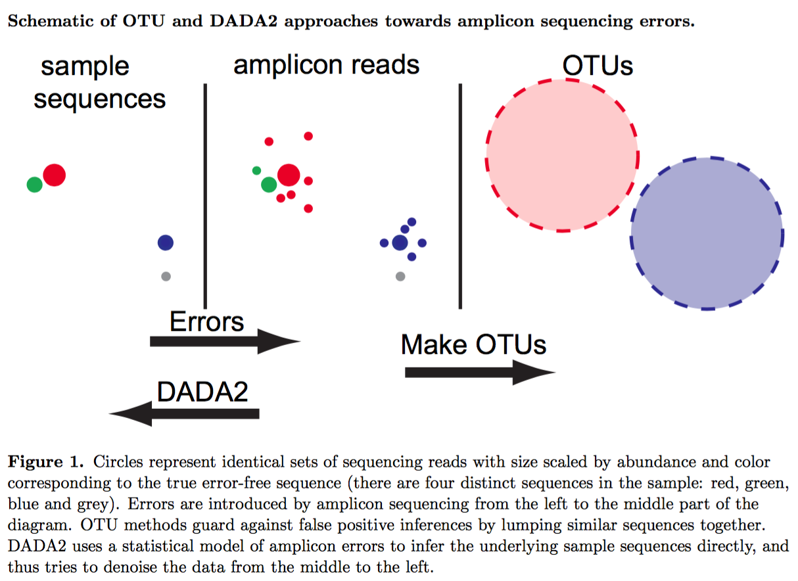
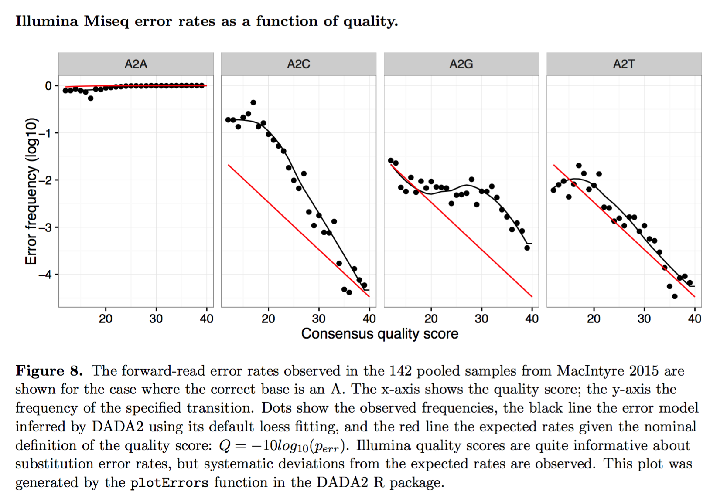

Useful Information
******************

Introduction
============

This section describes select information and resources pertaining to microbiome bioinformatics that I find particularly useful.

Adapters and Primers
====================

Identification and subsequent removal of adapters and primers from raw sequence data is important for many downstream analyses. In order to achieve this, first you need to know some experimental details that are specific to your sequencing run, including the primers.

Take the primer pair shown below as an example. The top one is called 341F and the bottom, 805R. Together, they are used to amplify the 16S V3-V4 region.

.. parsed-literal::

    5'-TCGTCGGCAGCGTC AGATGTGTATAAGAGACAG CCTACGGGNGGCWGCAG-3'
    5'-GTCTCGTGGGCTCGG AGATGTGTATAAGAGACAG GACTACHVGGGTATCTAATCC-3'

For better display, I divided each primer into three segments. The segment on the right side is the locus-specific sequence (i.e. the 16S V3-V4 region in this case). The middle segment has two roles: 1) as the Nextera Tn5 binding site; it serves as the transposase recognition sequence, namely 19-bp Mosaic End (ME) and 2) as the binding site for sequencing primers. Lastly, the left segment is the Nextera N/S5xx or N7xx primer entry point. It's essentially an overhang adapter sequence, which is used as the binding site for Nextera (XT) N/S5xx and N7xx Index primers, as shown below (note the overlaps).

.. parsed-literal::

    5'-AATGATACGGCGACCACCGAGATCTACAC [8-bp i5 index] TCGTCGGCAGCGTC-3'
    5'-CAAGCAGAAGACGGCATACGAGAT [8-bp i7 index] GTCTCGTGGGCTCGG-3'

For each primer, the left segment is Illumina P5 or P7 adapter that binds to the flowcell. The middle segment is sample-specific index. The right segment was already explained above.

This `page <https://dnatech.genomecenter.ucdavis.edu/wp-content/uploads/2013/06/illumina-adapter-sequences_1000000002694-00.pdf>`__ from Illumina summarizes well all of their adapter sequences.

See the :ref:`qiime2_cli:Removal of Adapters and Primers` section to learn how to remove adapters and primers using QIIME 2 CLI.

Below is additional primer information for amplifying variable regions other than the V3-V4 region.

.. parsed-literal::

    515F/806R amplifies the V4 region.
    [515F] 5'-GTGCCAGCMGCCGCGGTAA-3'
    [806R] 5'-GGACTACHVGGGTWTCTAAT-3'

Alpha Diversity
===============

Robert Whittaker argued that in ecology, the total species diversity in a landscape (gamma diversity) is determined by two different things, the mean species diversity in sites or habitats at a more local scale (alpha diversity) and the differentiation among those habitats (beta diversity). In human microbiome analysis, we tend to only focus on alpha diversity (diversity within samples) and beta diversity (diversity between samples). There are three popular measurements of alpha diversity: Shannon's diversity index, Pielou's evenness index, and Faith's phylogenetic diversity.

Shannon's Diversity Index
-------------------------

The measure was originally proposed by Claude Shannon to quantify the entropy (uncertainty or information content) in strings of text. The idea is that the more different letters there are, and the more equal their proportional abundances in the string of interest, the more difficult it is to correctly predict which letter will be the next one in the string. The Shannon entropy quantifies the uncertainty (entropy or degree of surprise) associated with this prediction. It is most often calculated as follows:

:math:`{H}'=-\sum_{i=1}^{R}p_i \ln p_i`

where :math:`p_i` is the proportion of characters belonging to the :math:`ith` type of letter in the string of interest. In ecology, :math:`p_i` is often the proportion of individuals belonging to the :math:`ith` species in the dataset of interest. Then the Shannon entropy quantifies the uncertainty in predicting the species identity of an individual that is taken at random from the dataset.

Both the Shannon and Simpson indices include the measurement of community heterogeneity. However, in my opinion, Shannon is a better index as it shows both richness and abundance.

Beta Diversity
==============

Note that multiple dimensional scaling (DMS) is equivalent to principal coordinates analysis (PCoA). Also, when the distance metric used is Euclidean, both PCoA and MDS are equivalent to PCA.

Note that jaccard uses pairwise presence/absence data (i.e. ignores infomration about abundance) and gives the percentage of taxa not found in both samples. Similarly, unifrac gives the percentage of phylogenetic branch length not found in both samples.

However, be aware that PCA is generally not the preferred ordination technique in microbial ecology because it assumes samples are linearly related.

Does PCoA Generate Loadings?
----------------------------

One main reason why principal component analysis (PCA) is so popular is because it generates variable loadings. These loadings are the coefficients of the linear combination of the variables from which the principal components are constructed (i.e. they help you interpret the principal components).

Unlike PCA, PCoA does not output loadings because it is computed based on a distance matrix (which is symmetric), and distance functions preserve no information about the features that make up the distances.

Instead of variable loadings, you can compute PCoA biplots which can tell you which features are correlated with what axes of variation and what samples.

Bray-Curtis Dissimilarity
-------------------------

The Bray-Curtis dissimilarity is one of the most popular techniques for quantifying the difference between samples. As much tempting as it sounds, it is not a distance metrics, hence the word "dissimilarity" in the name. This is because it does not satisfy the triangle inequality axiom.

:math:`BC=\sum \left | u_i - v_i \right | / \sum \left | u_i + v_i \right |`

UniFrac Distance
----------------

There are weighted (quantitative) and unweighted (qualitative) variants of UniFrac, where the former accounts for abundance of observed organisms, while the latter only considers their presence or absence.

UniFrac = (sum of unshared branch lengths / sum of all tree branch lengths) = fraction of total unshared branch lengths

ASV Identification by DADA2
===========================

Above figure was taken from Callahan et al. 2016 (PMID: 27214047).

There largely four steps involved.

Step 1: Error Model Parameterization

Step 2: Learning Error Rate

DADA2 models errors as occurring independently within a read, and independently between reads. Under this model, the rate at which an amplicon read with sequence i is produced from sample sequence j is reduced to the product over the transition probabilities between the L aligned nucleotides:

:math:`\lambda_ji=\prod_{l=0}^{L}p(j(l)\rightarrow i(l),q_i(l))`

Step 3: Obtaining Abundance p-Value

:math:`p_A(j\rightarrow i)=\frac{1}{1-\rho_{\textrm{pois}}(n_j\lambda_{ji},0)} \sum_{a=a_i}^{\infty}\rho_{\textrm{pois}}(n_j\lambda_{ji},a)`

Step 4: Divisive Partitioning Algorithm

First, amplicon reads are dereplicated, only leaving unique sequences. Next, all unique sequences are put into a single partition, with the most abundant sequence assigned as the center of that partition. All unique sequences are then compared to the center of their partition, error rates are calculated and stored, and the abundance p-value is calculated for each unique sequence.

The net result is that each read is denoised by replacing it with the central sequence of its partition.

According to the DADA 2 tutorial:

    Your reads must still overlap after truncation in order to merge them later! The tutorial is using 2x250 V4 sequence data, so the forward and reverse reads almost completely overlap and our trimming can be completely guided by the quality scores. If you are using a less-overlapping primer set, like V1-V2 or V3-V4, your truncLen must be large enough to maintain 20 + biological.length.variation nucleotides of overlap between them.

This `issue <https://github.com/benjjneb/dada2/issues/817>`__ also provides a good summary of the topic.

    If your amplicon is ~450 nts, you will want over 450+20+biological_length_variation nts of total sequence after truncation. The last 80 nts of your reverse reads looks bad. I think I would try truncLen=c(280,210) as my starting point. That should give you enough overlap between the reads (490nts).

This `post <https://forum.qiime2.org/t/dada2-trimming-question/907>`__ illustrates the importance of removing the primer sequences.

According to this `paper <https://pubmed.ncbi.nlm.nih.gov/21212162/>`__:

    Formation of chimeric sequences during PCR. An aborted extension product from an earlier cycle of PCR can function as a primer in a subsequent PCR cycle. If this aborted extension product anneals to and primes DNA synthesis from an improper template, a chimeric molecule is formed.

This `website <https://benjjneb.github.io/dada2/index.html>`__ gives a very thorough tutorial. There are multiple steps required to set up the DADA2 environment. This website saved the day for me (`ref <http://www.metagenomics.wiki/tools/16s/dada2/conda>`__). Also, install Jupyter Notebook for R (`ref <https://izoda.github.io/site/anaconda/r-jupyter-notebook/>`__).

.. parsed-literal::

    # Create a new environment.
    $ conda create -n dada2-v1.14 -c conda-forge -c bioconda -c defaults --override-channels bioconductor-dada2=1.14

    # Activate the environment.
    $ conda activate dada2-v1.14

    # Confirm the dada2 installation.
    $ R
    > library(dada2); packageVersion("dada2")
    Loading required package: Rcpp
    [1] ‘1.14.0’

    # Install Jupyter Notebook.
    $ conda install -c conda-forge notebook

    # Install the R-kernel.
    $ conda install r-recommended r-irkernel

    # Add the R-kernel to Jupyter by installing a kernel spec.
    $ R -e 'IRkernel::installspec()'

    filterAndTrim

    This function from DADA2 filters and trims an input fastq file(s) (can be compressed) based on several user-definable criteria, and outputs fastq file(s) (compressed by default) containing those trimmed reads which passed the filters (`ref <https://rdrr.io/bioc/dada2/man/filterAndTrim.html>`__).

Differential Abundance
======================

The qiime longitudinal pairwise-differences command allows pairwise analysis for single taxon at a time. However, it does not support testing multiple taxa simultaneously, which may seem odd at first. It turns out, the QIIME 2 team intentionally made this not possible because the Wilcoxon signed-rank test used in the command is not appropriate for compositional microbiome data (i.e. it will have a high false-positive error rate). For more details, see this `post <https://forum.qiime2.org/t/compare-more-taxa-simultaneously-using-pairwise-difference/10320>`__ from the QIIME 2 forum.

Below are some informative posts from the QIIME 2 forum:

- `Pairwise ANCOM and Gneiss, filtering and interpretation <https://forum.qiime2.org/t/pairwise-ancom-and-gneiss-filtering-and-interpretation/6361>`__
- `Pairwise testing of ANCOM results <https://forum.qiime2.org/t/pairwise-testing-of-ancom-results/2461>`__
- `Taxa abundance analysis <https://forum.qiime2.org/t/taxa-abundance-analysis/845>`__
- `Compare more taxa simultaneously using pairwise-difference <https://forum.qiime2.org/t/compare-more-taxa-simultaneously-using-pairwise-difference/10320>`__

Paired Testing
--------------

As of December 14, 2020, ANCOM in QIIME 2 does not support paired testing. However, ANCOM in scikit-bio does allow paired testing. For more details, see my ``best-of-the-forum`` `post <https://forum.qiime2.org/t/differential-abundance-analysis-e-g-ancom-for-paired-samples-e-g-normal-tissue-vs-tumor-tissue-from-cancer-patients/17649>`__ in the QIIME 2 forum. In this post, I also show that the ALDEx2 program is a good alternative for ANCOM when it comes to differential abundance analysis with paired testing.

ALDEx2
------

ADLEx2 is an unified platform for differential abundance analysis. It involves a sampling process as described below:

    First, sequences that map to each feature are enumerated and the table of read counts for each feature in each sample is converted to a distribution of posterior probabilities through Monte Carlo sampling from the Dirichlet distribution for each sample:

    :math:`p[n1,n2,...]|\sum N=\textrm{Dir}\left ( [n1,n2,...]+\frac{1}{2} \right )`

    An uninformative prior of 1/2 is used to model the frequency of features with zero counts [28,29].

LEfSe
-----

In this section, I will walk you through how I run the LEfSe (linear discriminant analysis effect size) tool. But before I do that, it is important for you to acknowledge this:

    LEfSe method is more a discriminant analysis method rather than a DA method. (Lin and Peddada, 2020; PMID: 33268781)

In order to use LEfSe, you will need to open two Terminal windows: one for your usual QIIME 2 environment and another for running LEfSe. For the latter, you should create a new conda environment and install LEfSe as described below.

1. Terminal for running QIIME 2 and Dokdo:

.. code-block:: console

    $ conda activate qiime2-2020.8

2. Terminal for running LEfSe:

.. code-block:: console

    $ conda create -n lefse -c conda-forge python=2.7.15
    $ conda activate lefse
    $ conda install -c bioconda -c conda-forge lefse

After you have both terminals set up, you can create an input file for LEfSe from a QIIME 2 feature table. We will use the "Moving Pictures" tutorial as an example (run below in the QIIME 2 terminal).

.. code-block:: console

    $ dokdo prepare-lefse \
    -t data/moving-pictures-tutorial/table.qza \
    -x data/moving-pictures-tutorial/taxonomy.qza \
    -m data/moving-pictures-tutorial/sample-metadata.tsv \
    -o output/Useful-Information/input_table.tsv \
    -c body-site \
    -u subject \
    -w "[body-site] IN ('tongue', 'gut', 'left palm')"

Click :download:`here <lefse/input_table.tsv>` to download the ``input_table.tsv`` file.

Next, we need to format the input table (run below in the LEfSe terminal):

.. code-block:: console

    $ lefse-format_input.py \
    output/Useful-Information/input_table.tsv \
    output/Useful-Information/formatted_table.in \
    -c 1 \
    -u 2 \
    -o 1000000 \
    --output_table output/Useful-Information/formatted_table.tsv

Click :download:`here <lefse/formatted_table.in>` to download the ``formatted_table.in`` file.
Click :download:`here <lefse/formatted_table.tsv>` to download the ``formatted_table.tsv`` file.

We can run LEfSe with (run below in the LEfSe terminal):

.. code-block:: console

    $ run_lefse.py \
    output/Useful-Information/formatted_table.in \
    output/Useful-Information/output.res

Which will give:

.. code-block:: console

    Number of significantly discriminative features: 199 ( 199 ) before internal wilcoxon
    Number of discriminative features with abs LDA score > 2.0 : 199

Click :download:`here <lefse/output.res>` to download the ``output.res`` file.

We can then list the discriminative features and their LDA scores (run below in the LEfSe terminal):

.. code-block:: console

    $ lefse-plot_res.py \
    output/Useful-Information/output.res \
    output/Useful-Information/output.pdf \
    --format pdf

Click :download:`here <lefse/output.pdf>` to download the ``output.pdf`` file.

Finally, you can create a cladogram for the discriminative features (run below in the LEfSe terminal):

.. code-block:: console

    $ lefse-plot_cladogram.py \
    output/Useful-Information/output.res \
    output/Useful-Information/output.cladogram.pdf \
    --format pdf

Click :download:`here <lefse/output.cladogram.pdf>` to download the ``output.cladogram.pdf`` file.

Common Contaminants and Negative Controls
=========================================

Index Hopping
-------------

According to Hornung et al. (PMID: 30997495):

    It can occur 0%–10% of the sequenced data (Sinha et al. 2017a), depending on the used Illumina platform.

    In practice, the negative controls might contain exactly the same profile as the sequenced samples. In these cases it is impossible to distinguish between true contamination and index hopping, making the controls (negative as well as positive) potentially useless.

Removing Contaminants
---------------------

According to Karstens et al. (PMID: 31164452):

1. Identify and remove sequences that have been previously identified as contaminants in published databases or reference lists.
2. Apply an abundance filter to remove all sequences that are below a defined relative abundance threshold.
3. Remove sequences that are present in a negative-control sample.
4. Identify bacterial sequences that have an inverse correlation with bacterial DNA concentration after 16S rRNA library preparation.
5. Use a Bayesian approach implemented in SourceTracker (21) to predict the proportion of an experimental sample that arose from a defined contaminant source.

Meaning of Double Underscore in Taxa Names
==========================================

When working with a collapsed feature table (e.g. at the species level), we often encounter taxa names with double underscore like:

.. parsed-literal::

    k__Bacteria;p__Actinobacteria;c__Actinobacteria;o__Actinomycetales;f__Geodermatophilaceae;__;__
    k__Bacteria;p__Actinobacteria;c__Actinobacteria;o__Actinomycetales;f__Geodermatophilaceae;g__;s__

One question that gets frequently asked about this is: Should they be treated as the same taxon (i.e. duplicates)? The answer is no. Below I will provide an explanation for why, based on this `post <https://forum.qiime2.org/t/follow-up-on-unique-taxonomy-strings-that-seem-to-be-shared/1961/2>`__ from the QIIME 2 Forum:

The distinction is that the first row (ending in ;) cannot be confidently classified beyond family level (probably because a close match does not exist in the reference database). So sequences receiving that classification can be any taxon in f__Geodermatophilaceae. The second row (ending in ``g__;s__``) DOES have a close match in the reference database and hence is confidently classified at species level — unfortunately, that close match does not have genus or species-level annotations. This does not in any way imply that these two different taxonomic affiliations are related beyond the family level, so it would probably be inappropriate (or at least presumptuous) to collapse these at species level.

Beta Significance Test
======================

There are at least two QIIME 2 commands for performing a beta group signifiance test: ``beta-group-significance`` and ``adonis``. The former accepts only a single grouping variable (i.e. one-way tests) while the latter can accept multiple grouping variables (i.e. multi-way tests). They are both based on a permutation-based statistical test.

``adonis`` performs ANOVA (analysis of variance) by partitioning distance matrices among sources of variation and fitting linear models (e.g., factors, polynomial regression) to distance matrices. It uses a permutation test with pseudo-F ratios to compute p-values. Insofar as it partitions sums of squares of a multivariate data set, it is directly analogous to MANOVA (multivariate analysis of variance).

According to this `post <https://archetypalecology.wordpress.com/2018/02/21/permutational-multivariate-analysis-of-variance-permanova-in-r-preliminary/#:~:text=Permutational%20multivariate%20analysis%20of%20variance%20(PERMANOVA)%20is%20a%20non%2D,are%20equivalent%20for%20all%20groups.>`__:

    Permutational multivariate analysis of variance (PERMANOVA) is a non-parametric multivariate statistical test. It is used to compare groups of objects and test the null hypothesis that the centroids and dispersion of the groups as defined by measure space are equivalent for all groups. A rejection of the null hypothesis means that either the centroid and/or the spread of the objects is different between the groups. Hence the test is based on the prior calculation of the distance between any two objects included in your experiment.

RuntimeError by Click in Non-US Server
======================================

If you are running QIIME 2 in a non-US server -- like I do in South Korea -- there is a high chance you will encounter ``RuntimeError`` by the `Click package <https://click.palletsprojects.com/en/7.x/>`__ when you try to submit a job to the Sun Grid Engine (SGE) with ``qsub``. QIIME 2 uses the package to create its CLI, and the error is usually caused because the non-US server's locale environment is not compatible with Click (i.e. language issues). Note that this error only appears if you are running QIIME 2 commands in SGE instead of the interactive shell. The error can be avoided by adding ``export LC_ALL=en_US.utf-8`` and ``export LANG=en_US.utf-8`` in your script. Here's an example template (``qsubme.sh``):

.. code-block:: console

    #!/bin/bash

    export LC_ALL=en_US.utf-8
    export LANG=en_US.utf-8

    Your QIIME 2 command...

Click `here <https://forum.qiime2.org/t/runtimeerror-click-will-abort-further-execution-because-python-3-was-configured-to-use-ascii-as-encoding-for-the-environment/7460>`__ to see a relevant post in the QIIME 2 Forum.

phyloseq
========

To create a phyloseq object from a .qza file:

.. parsed-literal::

    ps <- qza_to_phyloseq(
      features=features_file,
      tree=tree_file,
      taxonomy=taxonomy_file,
      metadata=metadata_file
    )

To subset some samples that meet certain criteria:

.. parsed-literal::

    ps <- subset_samples(ps, subset_exp)

To filter out taxa whose combined read count is less than 10:

.. parsed-literal::

    ps <- filter_taxa(ps, sum(x) >= 10, TRUE)

decontam
========

Background
----------

Decontam provides two methods for contaminant identification: 1) frequency-based and 2) prevalence-based.

The frequency-based method assumes in the limit S >> C,

Fc = C/(C + S) ~ 1/T

Fs = S/(C + S) ~ 1

For each sequence feature, two models are compared: a contaminant model, in which expected frequency varies inversely with total DNA concentration, and a non-contaminant model, in which expected frequency is independent of total DNA concentration.

Important note from the authors of decontam:

    Frequency-based contaminant identification is not recommended for extremely low-biomass samples (C~S or C > S) because the simple approximations we are making for the dependence of contaminant frequency on total DNA concentration break down when contaminants comprise a large fraction of sequencing reads.

The prevalence-based method works in the following way:

    For each sequence feature, a chi-square statistic on the 2 × 2 presence-absence table in true samples and negative controls is computed, and a score statistic P is defined as the tail probability of the chi-square distribution at that value.

Reference: Simple statistical identification and removal of contaminant sequences in marker-gene and metagenomics data (PMID: 30558668)

Running decontam
----------------

Before running the decontam program, we first need to set up the working environment. As a starter, create a fresh conda environment:

.. code-block:: console

    $ conda create -n decontam -c bioconda bioconductor-phyloseq bioconductor-decontam
    $ conda activate decontam
    $ conda install -c r rstudio

Next, install ``qiime2R`` in the same environment:

.. parsed-literal::

    # This should be run in a R script.
    if (!requireNamespace("devtools", quietly = TRUE)){install.packages("devtools")}
    devtools::install_github("jbisanz/qiime2R")
